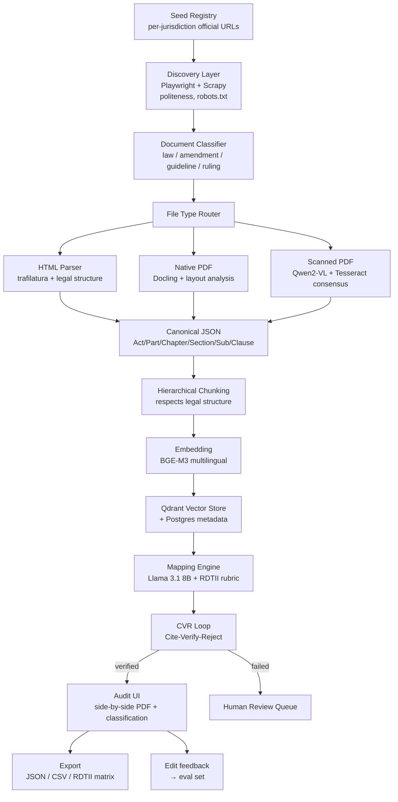
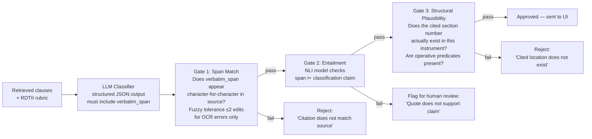

# UN AI Hackathon 2026 — Battle Plan
## AI for Digital Trade Regulatory Analysis | Application + Build Strategy

> **Status:** Draft v1.0 — written for a 2-person engineering team (+1 legal recruit), heavy part-time, 9 days to deadline, 24GB L40S compute, demo jurisdictions: **Bangladesh + Thailand + Singapore**.
>
> **Goal:** Win.

---

## Table of Contents

1. [Winning Thesis (read this first)](#1-winning-thesis)
2. [Project Identity](#2-project-identity)
3. [Team Composition Strategy](#3-team-composition-strategy)
4. [Demo Jurisdictions — Why These Three](#4-demo-jurisdictions)
5. [System Architecture](#5-system-architecture)
6. [The Anti-Hallucination Core (CVR Loop)](#6-the-anti-hallucination-core)
7. [Tech Stack — Final Decisions](#7-tech-stack)
8. [Application Form — Drafted Answers](#8-application-form-drafts)
9. [Technical Memo (750 words)](#9-technical-memo-750-words)
10. [Concept Video Script (5 minutes)](#10-concept-video-script)
11. [9-Day Build Roadmap](#11-9-day-build-roadmap)
12. [Post-Application Plan (Round 1 + Finals)](#12-post-application-plan)
13. [Evaluation Strategy](#13-evaluation-strategy)
14. [Risk Register](#14-risk-register)
15. [Pre-Submission Checklist](#15-pre-submission-checklist)
16. [Open Questions / Decisions Needed](#16-open-questions)

---

## 1. Winning Thesis

The hackathon has four explicit judging pillars (from the video):

1. **Substantive accuracy**
2. **Human-in-the-loop UX**
3. **Sustainable architecture** (open weights, no vendor lock-in)
4. **Technical resilience** against complex real-world data

Most teams will nail one or two. A typical entry will be:
- A clean RAG demo on EU/Singapore English-language PDFs, with GPT-4-class API calls, a Streamlit UI, no scanned-document handling, no jurisdiction-specific gold-standard evaluation, and a hand-wavy "we use chain-of-thought to reduce hallucination" answer to Q6.

**We win by being demonstrably different on all four pillars at once.** Specifically:

| Pillar | The differentiator we will ship |
|---|---|
| Substantive accuracy | Hand-labeled **gold-standard eval set** (50+ clauses across 3 jurisdictions, 2 non-English languages) + reported precision/recall numbers in the application itself |
| Human-in-the-loop UX | **Bounding-box highlighting** of the source span on the original PDF, side-by-side with the extracted classification — not just "here's the quote" but "here is the quote *in its original visual context*" |
| Sustainable architecture | **Llama 3.1 / Qwen 2.5 + BGE-M3 + Qdrant**, fully self-hostable on the L40S, Apache 2.0 from day one, plugin architecture for new pillars and new jurisdictions |
| Technical resilience | **Multi-engine OCR with consensus voting** for scanned Bengali/Thai documents — the kind of data most teams will skip. Cryptographic citation chain. Conflict detection between sources. |

The single most important narrative to land in the application: **"We treat hallucination not as a quality issue but as a structural impossibility — the model cannot output a classification without a verbatim, hash-anchored, NLI-verified citation. If verification fails, the output is rejected, not softened."**

That sentence (or its essence) should appear in the summary, Q4, Q6, the technical memo, AND the video.

---

## 2. Project Identity

### Name candidates

| Name | Pros | Cons |
|---|---|---|
| **ClauseChain** | Evokes the citation chain (anti-hallucination), references "blockchain" provenance feel, distinctive | Mildly tech-bro |
| **LexLens** | Clean, scans well in print, suggests transparency | Slightly generic |
| **RegMap** | Literally describes the task (mapping regulations) | Too plain |
| **Veritas / VeritasReg** | "Truth in regulation" — strong UN-aligned framing | Latin may feel pretentious |
| **Stere** (from *stare decisis*) | Sophisticated legal nod | Obscure |

**Recommendation: `ClauseChain`** — secondary tagline: *"Hash-anchored regulatory evidence for digital trade."* The name does work for you: it telegraphs the citation chain (which is the differentiator) before judges read a single technical detail.

### Tagline options

- "Every claim, a citation. Every citation, verified."
- "From scanned statute to verified evidence — automatically."
- "The audit trail for digital trade regulation."

### Positioning sentence (use in every artifact)

> ClauseChain is an open-source AI pipeline that discovers, extracts, and maps digital trade regulations to the UN RDTII framework — producing only outputs anchored to verbatim, hash-verified citations from authoritative source documents.

---

## 3. Team Composition Strategy

You said: you + 1 engineer, plus a legal/policy recruit needed. The ideal team is **3 people** — 4 if you can find one more strong contributor without diluting communication.

### The three roles

**1. Technical Lead (you)**
- Architecture, retrieval pipeline, embeddings, vector DB, eval framework
- Owns the system end-to-end

**2. Frontend / OCR Engineer (your teammate)**
- Audit UI (React + PDF.js with bounding box overlay)
- Document ingestion: HTML parser, PDF layout extraction, OCR pipeline
- Multilingual handling

**3. Legal / Policy Lead (to recruit)**
- Curates seed URLs per jurisdiction
- Hand-labels the gold-standard evaluation set (this is **critical** — without this person, you have no defensible accuracy claim)
- Interprets the RDTII rubric, writes the classification taxonomy
- Reviews ambiguous outputs

### Where to find the legal recruit (Bangladesh)

In priority order:

1. **University of Dhaka, Department of Law** — final-year LLB or LLM students. Email the faculty office; explain it's a UN-affiliated project with a Bangkok finale possibility. Many will jump at this.
2. **BRAC University School of Law** — similar pitch.
3. **North South University, Department of Law and Justice** — strong on cyber law / data protection.
4. **Bangladesh Legal Aid and Services Trust (BLAST)** or similar policy NGOs — for someone with applied data-protection-law exposure.
5. **LinkedIn search:** "data protection" + "Bangladesh" + "lawyer" — there's a small but growing community around the draft Personal Data Protection Act.

What you need from them in the next 9 days:
- 2-page CV / profile for the team profiles PDF
- 4 hours: read the RDTII Pillar 6 + 7 rubric, list the BD/TH/SG primary instruments
- 6 hours: label 30 clauses from those instruments (yes/no/which-pillar/which-sub-criterion)
- 2 hours: review the application Q1–Q6 answers for legal accuracy

**Backup plan if you can't find them in time:** apply with two people and a "legal advisor — to be confirmed" slot in the team profile. Be honest about it. The application doesn't require all members named at submission; teams can grow during Round 1.

### Team profile PDF (deliverable)

One PDF, 3 pages (one per person). Each page:

- Name, role, photo (optional)
- 3-line bio
- Relevant skills (be specific — "built a SaaS RAG product crawling 200+ company websites, generated embedding-based chatbots with traceable citations" is much stronger than "ML engineer")
- Links: GitHub, LinkedIn, portfolio
- For the legal lead: jurisdictions of expertise, any published work, professional affiliations

---

## 4. Demo Jurisdictions

### Why Bangladesh + Thailand + Singapore

| Jurisdiction | Strategic value | Documents to target | Language |
|---|---|---|---|
| **Bangladesh** | (1) Home advantage — your team can read sources natively. (2) **Underrepresented** in digital-trade-law tooling — most teams will pick EU/Singapore/UK. Standing out matters. (3) Multilingual case (Bengali + English). (4) Mix of HTML and scanned PDF. | Digital Security Act 2018; draft Personal Data Protection Act 2023; ICT Act 2006 (as amended); Bangladesh Telecommunication Regulatory Act | English (primary) + Bengali |
| **Thailand** | (1) **Host country of the finale** — judging panel will know these laws intimately. (2) Strong, mature PDPA (2019) — clean test case. (3) Both HTML and Thai-language scanned amendments available. | PDPA 2019; Computer Crime Act 2007 (as amended 2017); ETDA Royal Decrees | Thai + English |
| **Singapore** | (1) Gold-standard, well-documented — perfect for accuracy testing. (2) Available in clean HTML on `sso.agc.gov.sg`. (3) Establishes credibility — if your tool works on Singapore, it works. | PDPA 2012 (as amended); Cybersecurity Act 2018; MAS notices on data | English |

The trio also gives you three distinct technical challenges:
- **Singapore:** Easy mode — clean HTML, English, well-structured. (For accuracy benchmarking.)
- **Thailand:** Medium — Thai-script OCR, dual-language drafting, scanned older amendments.
- **Bangladesh:** Hard — mixed Bengali/English, scanned-PDF heavy, less-curated sources.

Demonstrating success across this difficulty gradient is the **single most compelling part of your application**. Most teams won't dare touch Bengali OCR.

### Seed URLs (start the crawler bookmarks file now)

**Bangladesh:**
- `bdlaws.minlaw.gov.bd` — primary legislative database
- `dpdt.portal.gov.bd` — Department of Patents, Designs and Trademarks (also data-related)
- `btrc.gov.bd` — Telecom regulator
- `bcc.gov.bd` — Bangladesh Computer Council

**Thailand:**
- `ratchakitcha.soc.go.th` — Royal Gazette
- `pdpc.or.th` — Personal Data Protection Committee
- `etda.or.th` — Electronic Transactions Development Agency

**Singapore:**
- `sso.agc.gov.sg` — Singapore Statutes Online
- `pdpc.gov.sg` — PDPC guidelines and advisory rulings
- `mci.gov.sg` — Ministry of Communications and Information

---

## 5. System Architecture

### High-level flow



### Component-by-component

#### Layer 1: Discovery

- **Seed registry:** YAML file, one block per jurisdiction, listing official-source URLs, document-type patterns, and authority hierarchy (primary legislation > regulation > guideline).
- **Crawler:** Playwright for JS-heavy government sites; httpx for static HTML; Scrapy as the orchestrator. Politeness: respect robots.txt, 1-2 req/sec, identifying User-Agent (`ClauseChain/1.0 (UN-Hackathon; contact@…)`).
- **Document classifier:** Small classifier (DistilBERT fine-tuned, or Llama 3.1 8B zero-shot for the MVP) to tag each document: `act | amendment | regulation | guideline | court_ruling | other`.
- **Version tracking:** Each document gets a `version_id` derived from its publication date and instrument number. The graph of amendments → originals is stored in Postgres.

#### Layer 2: Ingestion

The hardest layer. Three sub-pipelines:

**HTML pipeline:**
- `trafilatura` for boilerplate removal
- Custom legal parser using regex + structural cues: detect "Article N", "Section N", "(1)", "(a)" patterns
- Output: canonical JSON tree

**Native PDF pipeline:**
- `Docling` (IBM open-source) for layout-aware extraction, OR
- `pypdfium2` + custom layout analysis using `PaddleOCR` layout model
- Preserves tables, footnotes, marginalia

**Scanned PDF pipeline (the differentiator):**
- **Primary:** Qwen2-VL-7B for high-quality OCR — handles Bengali and Thai well, preserves layout context.
- **Secondary:** Tesseract with language packs (`ben`, `tha`, `eng`) for cross-validation.
- **Consensus mechanism:** Token-level alignment between the two outputs; high-confidence regions accepted; mismatches flagged for human review or run through a third pass.
- **Page rasterization:** PDFs are also rendered to PNGs (300 DPI) and stored — needed for the bounding-box overlay in the audit UI.

All three pipelines emit the same **canonical JSON schema**:

```json
{
  "instrument_id": "BD-DSA-2018",
  "instrument_type": "act",
  "jurisdiction": "BD",
  "language": "en",
  "version": "2018-10-08",
  "source_url": "https://bdlaws.minlaw.gov.bd/act-1261.html",
  "source_hash_sha256": "…",
  "retrieved_at": "2026-05-17T08:00:00Z",
  "structure": [
    {
      "type": "section",
      "number": "26",
      "title": "Punishment for publishing false data, etc.",
      "text": "…",
      "children": [...],
      "char_offset": [12453, 13208],
      "page": 14,
      "bbox": [72, 220, 540, 380]
    }
  ]
}
```

The `char_offset`, `page`, and `bbox` fields are what make citations verifiable — they let us point back to the exact pixel region on the source.

#### Layer 3: Indexing

- **Chunking:** Not naive 512-token windows. We chunk at **clause boundaries** while attaching parent-section context as metadata. A retrieved sub-clause always "knows" its parent section.
- **Embeddings:** `BAAI/bge-m3` — 568M params, runs on the L40S in ~3GB, supports 100+ languages including Bengali and Thai, supports dense + sparse + multi-vector retrieval (we'll use dense + sparse for hybrid search).
- **Vector store:** Qdrant (open-source, self-hostable, supports hybrid search natively).
- **Metadata DB:** Postgres for instrument metadata, version graphs, audit trail.
- **Object storage:** MinIO (S3-compatible) for raw source documents and rendered page PNGs.

#### Layer 4: Mapping (classification)

This is where most teams will use "ask the LLM to classify". We do it differently.

**The RDTII rubric is encoded as structured YAML**, not as a free-form prompt. Example:

```yaml
pillar_6:
  name: "Cross-Border Data Policies"
  sub_criteria:
    - id: "6.1"
      name: "Data localization requirement"
      operative_predicates:
        - "data must be stored within national territory"
        - "data must be processed domestically"
        - "data cannot be transferred abroad"
      exception_indicators:
        - "except with consent"
        - "unless adequacy decision"
      typical_phrases:
        - "shall be stored in [country]"
        - "shall not be transferred outside"
    - id: "6.2"
      name: "Conditional cross-border transfer"
      …
```

**Classification flow for each clause:**
1. Retrieve relevant rubric criteria via embedding similarity.
2. Send to Llama 3.1 8B with a **structured JSON schema** (enforced via outlines/grammar):
   ```json
   {
     "applies_to_pillar": "6.1" | "6.2" | ... | null,
     "verbatim_supporting_span": "...",
     "principal_rule": "...",
     "exceptions": [...],
     "conditions": [...],
     "confidence": 0.0-1.0
   }
   ```
3. Pass to the CVR loop.

The structured-schema approach is critical: it prevents the model from emitting prose explanations that might contain hallucinations. The model can only fill defined slots.

#### Layer 5: Verification — the CVR Loop

See [Section 6](#6-the-anti-hallucination-core).

#### Layer 6: Audit UI

- **Frontend:** React + Tailwind + shadcn/ui
- **PDF rendering:** `PDF.js` with custom annotation layer for bounding-box overlay
- **Layout:** Two panes side-by-side:
  - **Left:** Source PDF (or HTML rendering) with the cited span highlighted via colored bounding box
  - **Right:** Classification card — pillar, sub-criterion, the verbatim quote, principal rule, exceptions, confidence score, "Approve / Edit / Reject" buttons
- **Confidence color-coding:** Green (>0.9 + verified), Yellow (0.7–0.9 or partial verification), Red (<0.7 — auto-flagged for review)
- **Conflict alerts:** When two different documents in the same jurisdiction give contradictory classifications, the UI surfaces this with a "⚠ Conflict" banner

#### Layer 7: Export

- **RDTII matrix CSV:** Rows = countries, columns = sub-criteria, cells = classification result with citation
- **JSON Lines:** Full audit trail, one classification per line, including provenance
- **Provenance ledger:** A separate append-only file that records every document version retrieved, with hash + URL + timestamp — so a third party can re-verify the entire dataset

---

## 6. The Anti-Hallucination Core

This is the most important section of the entire submission. Q4 and Q6 of the form are about this. The video should explain this in plain terms. The technical memo should diagram it.

### The CVR Loop (Cite — Verify — Reject)

Every output passes through three sequential gates. If any gate fails, the output is rejected — not "softened" with a disclaimer.



### What the model CAN do

- Fill the structured JSON schema (pillar, sub-criterion, verbatim_span, principal_rule, exceptions, conditions, confidence)
- Choose from a closed set of pillar/sub-criterion labels
- Quote text **only** from the retrieval results given in its context
- Output `null` for the pillar field if no retrieved evidence applies

### What the model CANNOT do

- Generate free-form prose anywhere in the citation pipeline
- Paraphrase the source — the `verbatim_span` field must be character-for-character from the retrieved chunk
- Use general knowledge — system prompt explicitly forbids "based on my training" reasoning
- Cite document sections that were not in its retrieval context
- Emit a classification without a non-empty `verbatim_span`

### How every claim links to evidence

Each classification record stores:

```
{
  "claim": "Section 26 of BD DSA establishes data localization",
  "verbatim_span": "Any person…shall not save such data…outside Bangladesh",
  "source": {
    "instrument_id": "BD-DSA-2018",
    "source_url": "https://bdlaws.minlaw.gov.bd/act-1261/section-46556.html",
    "source_hash_sha256": "a3f5…",
    "section_number": "26(1)",
    "page": 14,
    "char_offset": [12453, 12527],
    "bbox": [72, 248, 540, 286],
    "retrieved_at": "2026-05-17T08:14:22Z"
  },
  "verification": {
    "span_match": "exact" | "fuzzy_2_edits",
    "nli_score": 0.94,
    "structural_check": "passed",
    "final_decision": "approved"
  }
}
```

Any reviewer can:
1. Click the source URL → fetch the document → compute its SHA-256 → confirm it matches
2. Open the page → find the bounding box → see the exact pixel region cited
3. Re-run the NLI verifier on their own machine and reproduce the score

This is what we mean by "hash-anchored citation". The hallucination problem isn't reduced — it's structurally blocked.

### Failure case our design catches (for Q6)

> **Scenario:** The model is asked to classify Section 24 of Country X's PDPA. Section 24 actually addresses **data retention periods** (how long data may be held). The model, given retrieved context that mentions both "retention" and "transfer", incorrectly classifies it as **6.1 — Data localization requirement**.
>
> **How our system catches this before the user sees it:**
>
> 1. **Gate 2 (NLI):** The verifier runs an entailment check. The verbatim_span is "Personal data shall not be retained for longer than reasonably necessary…" The classification claim is "establishes data localization". The NLI model returns an entailment score of ~0.15. Below the 0.7 threshold → flagged.
>
> 2. **Gate 3 (Structural):** Sub-criterion 6.1 in our rubric requires the presence of operative predicates like "stored within", "processed domestically", "not transferred". A simple predicate search on the verbatim_span finds none. → rejected.
>
> The output is sent to the human review queue with both reasons attached, **not** shown to the end user as a confident classification.

This is the kind of concrete failure case Q6 explicitly asks for. Use this exact example in your answer.

---

## 7. Tech Stack

### Compute budget on the 24GB L40S

| Component | VRAM | Notes |
|---|---|---|
| Llama 3.1 8B Instruct (FP16) | ~16 GB | Primary classifier |
| Qwen 2.5 7B Instruct (4-bit) | ~6 GB | Secondary / verifier |
| Qwen2-VL 7B (4-bit) | ~7 GB | OCR for scanned docs |
| BGE-M3 embedder | ~3 GB | Embeddings |
| DeBERTa-v3-base NLI | ~0.5 GB | Verification gate |

Strategy: load Llama 3.1 8B + BGE-M3 + NLI persistently. Swap Qwen2-VL in/out only when processing scanned docs (separate batch job, not live).

If you find you need more headroom: rent an A100 80GB on RunPod/Vast.ai for $1–2/hour for the final demo recording. Budget: $50 should cover everything.

### Final stack

| Layer | Tool | Why |
|---|---|---|
| Crawling | Playwright + Scrapy | Handle JS-heavy gov sites |
| HTML parsing | trafilatura + custom legal parser | Article/section preservation |
| Native PDF | Docling | IBM open-source, layout-aware |
| OCR | Qwen2-VL 7B + Tesseract (consensus) | Bengali / Thai support |
| Embeddings | BAAI/bge-m3 | Multilingual, hybrid retrieval |
| Vector DB | Qdrant | Open-source, hybrid search |
| Metadata DB | Postgres | Standard, reliable |
| Object storage | MinIO | S3-compatible, self-hostable |
| LLM serving | vLLM | Fast, OpenAI-compatible API |
| Classifier LLM | Llama 3.1 8B Instruct | Strong, fits VRAM, open weights |
| Output structuring | Outlines / Pydantic | JSON schema enforcement |
| NLI verifier | microsoft/deberta-v3-base + MoritzLaurer/DeBERTa-v3-base-mnli-fever | Entailment scoring |
| Orchestration | Prefect 2 | Lighter than Airflow, easier setup |
| Backend API | FastAPI | Standard |
| Frontend | React + Vite + Tailwind + shadcn/ui | Fast dev, clean UI |
| PDF rendering | PDF.js with custom annotation layer | Bounding-box overlay |
| Deployment | docker-compose | Single-command self-host |
| License | Apache 2.0 | Required by hackathon |

### Repository structure (start this on day 1)

```
clausechain/
├── README.md                      # with quickstart + architecture diagram
├── LICENSE                        # Apache 2.0
├── docker-compose.yml             # one-command bring-up
├── seeds/
│   ├── bd.yaml                    # Bangladesh seed URLs
│   ├── th.yaml
│   └── sg.yaml
├── rubrics/
│   ├── pillar_6.yaml              # RDTII Pillar 6 structured rubric
│   └── pillar_7.yaml
├── eval/
│   ├── gold_set_bd.jsonl          # hand-labeled clauses
│   ├── gold_set_th.jsonl
│   ├── gold_set_sg.jsonl
│   └── run_eval.py
├── services/
│   ├── crawler/
│   ├── ingestion/
│   ├── classifier/
│   ├── verifier/
│   ├── api/
│   └── ui/
└── docs/
    ├── architecture.md
    ├── anti-hallucination.md
    └── adding-a-jurisdiction.md
```

The structure itself is a deliverable — judges will skim the repo, and a tidy layout signals competence.

---

## 8. Application Form — Drafts

> These are starting drafts. Polish each one with your legal teammate before submission. Word counts are tight — every word earns its place.

### Project Title

**`ClauseChain: Hash-Anchored Regulatory Evidence for Digital Trade`**

(Backup: `ClauseChain — Open-Source Regulatory Evidence Pipeline for the RDTII Framework`)

### Short Proposal Summary (200 words)

> Digital trade regulations exist across thousands of statutes, in dozens of languages, scattered across official gazettes, ministry portals, and scanned amendments. Mapping them to a comparable framework like the UN RDTII is manual, expensive, and error-prone. AI can accelerate this work — but only if its outputs are trustworthy.
>
> ClauseChain is an open-source AI pipeline that automatically discovers, extracts, and maps digital trade regulations to RDTII Pillars 6 and 7 (with an extensible architecture for the remaining pillars). What distinguishes it is a structural guarantee: every classification is bound to a verbatim, hash-anchored citation from an authoritative source, verified through a three-gate Cite-Verify-Reject loop. The model cannot output a classification without producing a verifiable quote; if verification fails, the output is rejected rather than softened.
>
> Built on open-weight models (Llama 3.1, BGE-M3, Qwen2-VL) and self-hostable infrastructure (Qdrant, Postgres, vLLM), ClauseChain is released under Apache 2.0 with no vendor lock-in. Our demo covers Bangladesh, Thailand, and Singapore — spanning English, Thai, and Bengali; HTML, native PDF, and scanned amendments — and ships with a hand-labeled gold-standard evaluation set so accuracy claims are reproducible by any third party.

### Problem Understanding & Objectives (200 words)

> The RDTII framework gives the international community a shared yardstick for digital trade governance, but populating it remains a slow, manual research task. As digital regulations proliferate — particularly across developing economies whose laws are often spread across primary acts, amendments, ministerial regulations, and non-binding guidelines, and frequently published only in scanned form — the gap between regulatory reality and analytical coverage widens.
>
> AI offers an obvious lever, but the standard generative approach is unsafe for legal and policy work: large language models hallucinate, paraphrase, and confidently misattribute. In a context where citations may influence policy or trade decisions, a fabricated reference is worse than no reference at all.
>
> ClauseChain's objective is to deliver a pipeline that scales human analytical capacity *without* sacrificing trust. Specifically: (1) automate retrieval of regulations from heterogeneous government sources, including scanned non-English documents; (2) classify clauses against the RDTII rubric with cited evidence; (3) make every claim reproducibly verifiable by a third party through hash-anchored provenance; and (4) keep humans firmly in the loop via a side-by-side audit UI. The result is a tool for trustworthy, evidence-based digital governance.

### Q1.1 — Linguistic conflict (150 words)

> The two phrases appear contradictory in isolation. The first is an **absolute prohibition** ("shall not transfer any personal data"). The second is a **conditional exception** ("except in accordance with requirements"). Read naively, one says "never" and the other says "sometimes" — a surface-level NLP system, especially one operating at sentence granularity, would flag these as conflicting modal claims.
>
> The conflict is purely linguistic and structural. The clauses live in different syntactic positions: the first is the principal rule; the second is a subordinate carve-out. They use opposing modal verbs ("shall not" vs "except"), which is precisely the lexical pattern that triggers contradiction detectors trained on general-purpose text. Without explicit handling of the principal-rule + exception relationship — a structure that is ubiquitous in statutory drafting — a system will misread the law as self-contradictory rather than as a regulated default with a controlled pathway.

### Q1.2 — Which takes precedence (150 words)

> The first phrase — the prohibition — is the primary regulatory standard. The second is an exception to it, operative only when its enumerated conditions are met. The legal-interpretation rule here is straightforward: a general rule with a qualified exception means the rule applies by default; the exception applies only when its preconditions are satisfied and the burden of demonstrating satisfaction lies with the party invoking it.
>
> The policy rationale is **data protection by default, controlled flow by exception**. The default protects the data subject; the exception creates a narrow, conditional pathway whose conditions exist precisely to preserve the protective standard. This structure mirrors GDPR (Article 44 + Chapter V), Singapore PDPA (Section 26), and Thai PDPA (Section 28). Our system therefore treats the prohibition as the regulatory baseline for Pillar 6 mapping, with the exception's conditions stored as machine-readable predicates that must be checked separately.

### Q1.3 — How to program the AI (150 words)

> Three layered mechanisms:
>
> **(1) Structural parsing.** Each provision is segmented and tagged with its role — `principal_rule`, `exception`, `condition`, `definition` — by a small classifier (DeBERTa fine-tuned on annotated statutory text). This tags the two clauses as `principal_rule` and `exception` rather than two independent assertions.
>
> **(2) Discourse linking.** A rule-based component detects subordinating connectors ("except", "unless", "provided that", "notwithstanding", "subject to") and binds exception clauses to their principal rule as a single composite *rule unit*. They are retrieved together, never in isolation.
>
> **(3) Structured classification.** The LLM is constrained to a JSON schema with separate fields for `principal_rule`, `exceptions[]`, and `conditions[]`. It cannot collapse the two phrases into a single free-text classification. A downstream verifier confirms the principal rule and exception share the same article/section reference and that conditions are explicitly listed.

### Q2 — End-to-end approach (250 words)

> ClauseChain implements the six-stage workflow as follows:
>
> **Collect.** A per-jurisdiction seed registry (YAML) lists official gazettes, ministry portals, and statute databases. Playwright handles JavaScript-heavy government sites; Scrapy orchestrates polite crawling (robots.txt, ≤2 req/sec, identifying User-Agent). A lightweight classifier tags each retrieved document as `act / amendment / regulation / guideline / ruling`.
>
> **Extract.** A file-type router dispatches to one of three sub-pipelines: HTML (trafilatura + a custom legal-structure parser), native PDF (Docling, layout-aware), or scanned PDF (Qwen2-VL-7B + Tesseract with consensus voting across the two OCR engines). All three emit a canonical JSON tree preserving the Act → Part → Chapter → Section → Sub → Clause hierarchy, with character offsets, page numbers, and bounding boxes for every node.
>
> **Classify.** The RDTII Pillars 6 and 7 are encoded as structured YAML rubrics with operative predicates and exception indicators. Clauses are embedded with BGE-M3 (multilingual), stored in Qdrant. For each clause, relevant rubric criteria are retrieved, and Llama 3.1 8B fills a constrained JSON schema (pillar, sub-criterion, verbatim_span, principal_rule, exceptions, conditions, confidence).
>
> **Explain.** The structured output is rendered in the audit UI: classification card on one side, original document with the cited span highlighted via bounding box on the other.
>
> **Cite.** Every claim carries a SHA-256 hash of the source document plus character offset and bbox — third-party reproducible.
>
> **Export.** Outputs serialise to JSON Lines, CSV (RDTII matrix), and an append-only provenance ledger.

### Q3 — Data Sources & Scope for Demo (250 words)

> The demo spans three jurisdictions chosen for their gradient of technical difficulty and policy diversity.
>
> **Bangladesh** (mixed English/Bengali; HTML + heavy scanned PDF; less-curated sources):
> - Digital Security Act 2018 — `bdlaws.minlaw.gov.bd/act-1261.html` (HTML)
> - Draft Personal Data Protection Act 2023 — `dpdt.portal.gov.bd` (PDF)
> - ICT Act 2006 (as amended) — `bdlaws.minlaw.gov.bd` (HTML + scanned amendments)
> - Bangladesh Telecommunication Regulatory Act 2001 — selected provisions
>
> **Thailand** (Thai + English; mature PDPA; scanned older amendments):
> - Personal Data Protection Act B.E. 2562 (2019) — `pdpc.or.th` (HTML + PDF, both languages)
> - Computer Crime Act B.E. 2550 (2007, as amended 2017) — `ratchakitcha.soc.go.th` (scanned PDF)
> - ETDA Royal Decrees on electronic transactions
>
> **Singapore** (clean English HTML; gold-standard for benchmarking):
> - Personal Data Protection Act 2012 (as amended) — `sso.agc.gov.sg` (HTML)
> - Cybersecurity Act 2018
> - Selected MAS notices on cross-border data
>
> Total target corpus for the prototype: approximately 15 primary instruments, ~600 clauses, ~3,000 PDF pages.
>
> Document types covered: structured HTML, native digital PDF, scanned image-based PDF (including Bengali and Thai scripts), and ministry HTML guidelines. The seed registry is extensible — adding a new jurisdiction is a single YAML file plus (for non-English jurisdictions) confirmation that BGE-M3 covers the language, which it does for all official UN languages and ~100 others.

### Q4 — Evidence & Citation Method (250 words)

> Citations in ClauseChain are not produced by the LLM — they are *imposed on* the LLM's output by structural constraint and then independently verified.
>
> Every classification record carries:
>
> - `verbatim_span`: text that must appear character-for-character in the retrieved source chunk (fuzzy tolerance ≤2 edits, exclusively for OCR-induced noise — not paraphrasing)
> - `source_url`: a stable URL to the original document
> - `source_hash_sha256`: hash of the source file at retrieval time
> - `instrument_id`, `section_number`, `page`, `char_offset`, `bbox`
> - `retrieved_at`: timestamp
>
> Verification runs in three sequential gates:
>
> **Gate 1 — Span Match.** The `verbatim_span` is matched against the source document. Exact match preferred; small fuzzy tolerance only to absorb OCR errors (e.g., Bengali ya/yo confusion, Thai tone marks). Failure → reject.
>
> **Gate 2 — Entailment.** A DeBERTa-v3 NLI model checks whether the verbatim_span entails the classification claim. Threshold 0.7. Failure → human review queue, not silent acceptance.
>
> **Gate 3 — Structural Plausibility.** The cited section number must exist in the instrument's parsed structure, and the rubric's operative predicates for the assigned sub-criterion must be lexically present (or semantically present with a secondary embedding check).
>
> Any third party can re-verify: download the source via `source_url`, compute its SHA-256, find the bounding box on the cited page, and re-run the NLI score locally. This is hash-anchored provenance — hallucinated citations become structurally impossible, not merely unlikely.

### Q5 — Three Sources Scenario (250 words)

> Step-by-step pipeline for the three-source scenario:
>
> **1. Authority classification.** Each source is tagged via the document classifier and the jurisdiction's authority hierarchy (stored in `seeds/{country}.yaml`): the HTML regulation is *primary legislation, authoritative*; the scanned amendment is *amending instrument, authoritative for the provisions it amends*; the ministry guideline is *non-binding interpretive guidance*. The guideline is retained as context but excluded from binding citations.
>
> **2. Ingestion.** The HTML page passes through trafilatura + legal parser. The scanned amendment is rasterized at 300 DPI and processed by Qwen2-VL-7B and Tesseract in parallel. Token-level consensus resolves OCR disagreements; remaining low-confidence regions are flagged. The guideline is parsed to canonical JSON and tagged `binding: false`.
>
> **3. Version reconciliation.** A version graph in Postgres records that the amendment modifies named sections of the HTML regulation. For any section touched by the amendment, the amended text supersedes the original. Sections untouched remain authoritative as published in HTML.
>
> **4. Clause retrieval.** The user asks for the cross-border-transfer rule. BGE-M3 hybrid retrieval returns candidate clauses across all three sources. The retriever metadata layer drops the guideline from the citation set (it remains visible as "interpretive context" in the UI).
>
> **5. Conflict resolution.** If the HTML and amendment disagree, the **amendment wins by recency**; the conflict is logged. The classification is generated against the controlling text.
>
> **6. Output.** Citation points to the amended section, with `source_hash_sha256` of the amendment PDF, page, and bounding box. The guideline appears as a separately-tagged supplementary note. Any unresolved OCR ambiguity in the cited span is surfaced as a yellow confidence flag in the audit UI for human approval.

### Q6 — Anti-Hallucination Design (250 words)

> ClauseChain enforces hallucination resistance structurally, not by prompt engineering alone.
>
> **What the model is allowed to do:** Fill a constrained JSON schema with (a) a `pillar` / `sub_criterion` chosen from a fixed enumeration, (b) a `verbatim_span` quoted from the retrieval context, (c) tagged fields for `principal_rule`, `exceptions`, `conditions`, and (d) a calibrated `confidence` score. Output `null` if no retrieved evidence applies.
>
> **What the model is not allowed to do:** Generate free-form prose; paraphrase the source text in citation fields; cite documents not present in retrieval context; use general or training-derived knowledge to make legal claims; emit a classification with an empty `verbatim_span`.
>
> **How every claim is linked to evidence:** Each output record carries `source_hash_sha256`, `source_url`, `section_number`, `page`, `char_offset`, and `bbox`. The `verbatim_span` is verified character-for-character against the source. An NLI verifier confirms entailment. A structural check confirms the cited section exists and that the rubric's operative predicates are present.
>
> **Failure case caught:** A model is asked to classify a clause that addresses *data retention periods*. Retrieved context contains lexical overlap with both "retention" and "transfer". The model labels it as `6.1 Data Localization`. Gate 2 (NLI) computes entailment between the verbatim_span ("Personal data shall not be retained for longer than reasonably necessary…") and the claim ("establishes data localization"): score 0.15. Gate 3 (Structural) searches for `6.1`'s operative predicates ("stored within", "processed domestically"); none found. The output is rejected before display, routed to the human review queue with both reasons attached.

### Backup Links field

YouTube unlisted link + Google Drive shareable link to the video. Make sure both are set to "anyone with the link can view" — and test in an incognito window before submitting.

---

## 9. Technical Memo (750 words)

> Upload this as a separate PDF. Keep it dense.

---

**ClauseChain — Technical Memo**

**Proposed System Architecture.** ClauseChain implements a seven-layer pipeline: discovery, ingestion, indexing, mapping, verification, audit, and export. A per-jurisdiction seed registry (YAML) drives a Playwright + Scrapy crawler that retrieves laws, amendments, regulations, and guidelines from official sources, respecting robots.txt and rate limits. A document classifier (DeBERTa-v3, zero-shot fallback via Llama 3.1) tags each retrieval by instrument type. A file-type router dispatches HTML to trafilatura plus a custom legal-structure parser, native PDFs to Docling, and scanned PDFs to a dual-engine OCR consensus stage (Qwen2-VL-7B as primary, Tesseract as secondary, token-level alignment for disagreement resolution). All ingestion paths converge on a canonical JSON tree preserving Act/Part/Chapter/Section/Sub/Clause hierarchy with character offsets, page numbers, and bounding boxes.

Indexing uses BAAI/bge-m3 multilingual embeddings (dense + sparse) stored in Qdrant, with Postgres for metadata and a version graph that records amendment relationships between instruments. MinIO holds source documents and rendered page PNGs.

The mapping layer encodes the RDTII Pillars 6 and 7 as structured YAML rubrics with named operative predicates, exception indicators, and typical phrases. For each clause, relevant rubric criteria are retrieved, and Llama 3.1 8B fills a JSON schema enforced by Outlines: pillar, sub-criterion, verbatim_span, principal_rule, exceptions[], conditions[], confidence. The classifier is forbidden from generating free-form text outside this schema.

**Tools, Models, and Methods.** Open-weight, self-hostable, Apache 2.0 throughout. LLM serving via vLLM on a 24GB GPU. Primary classifier: Llama 3.1 8B Instruct (FP16). OCR vision-language model: Qwen2-VL-7B (4-bit). Embeddings: BGE-M3 (multilingual, 100+ languages including Bengali and Thai). NLI verifier: DeBERTa-v3 fine-tuned on MNLI/FEVER. Vector store: Qdrant. Metadata: Postgres. Object storage: MinIO. Orchestration: Prefect 2. Backend: FastAPI. Frontend: React + Tailwind + shadcn/ui + PDF.js. Deployment: docker-compose for single-command bring-up. The architecture is modular — each layer exposes a clean interface and can be swapped (e.g., replace Llama with Qwen2.5 or a fine-tuned variant) without changing downstream consumers.

**Methods to Ensure Accuracy.** Accuracy is structurally enforced via the Cite-Verify-Reject (CVR) loop. Three sequential gates: (1) **Span Match** — the verbatim_span must appear character-for-character in the retrieved source, with edit-distance tolerance ≤2 reserved exclusively for OCR noise, not paraphrasing; (2) **Entailment** — DeBERTa-v3 NLI scores whether the verbatim_span entails the classification claim, threshold 0.7; (3) **Structural Plausibility** — the cited section must exist in the instrument's parsed tree, and the rubric's operative predicates for the assigned sub-criterion must be lexically or semantically present. Failure at any gate triggers rejection or human review — never silent acceptance. A hand-labeled gold-standard evaluation set (50+ clauses across three jurisdictions, two non-English languages) provides reproducible precision/recall/F1 measurements per pillar.

**Methods to Ensure Transparency.** Every output record carries source_url, source_hash_sha256, section_number, page, char_offset, and bbox. A third party can fetch the source, recompute the hash, locate the bounding box on the cited page, and re-run the NLI score locally. Citations are therefore hash-anchored and reproducible. The audit UI renders the cited span as a coloured overlay on the original PDF, side-by-side with the classification card. Confidence is colour-coded; conflicts between sources are surfaced as banners; human approvals, edits, and rejections feed into an append-only provenance ledger. A separate `docs/anti-hallucination.md` in the repository describes the failure modes the system is designed to catch.

**Methods to Ensure Cost Efficiency.** All models are open-weight and self-hostable on consumer-tier GPUs (24GB sufficient for the full demo stack with quantisation). No commercial API dependencies. Inference batching via vLLM yields >5x throughput on the L40S. Retrieval-augmented design means model context windows stay small (typically <4k tokens), reducing per-classification cost to near zero in self-hosted operation. Adding a new jurisdiction is one YAML file; adding a new pillar is one rubric file plus an evaluation set — no model retraining required. The system is designed so a small UN-affiliated office could operate it on a single workstation, indefinitely, with no recurring license fees.

---

(That's ~750 words. Trim or expand to fit exactly the limit.)

---

## 10. Concept Video Script (5 minutes)

**Format:** Screen-share with voiceover. Avoid talking-head — judges have 100+ to watch and visuals retain more attention. Open with the problem, then architecture diagram, then a live UI walkthrough, then commit.

**Voiceover script (~700 words, ~5 minutes at moderate pace):**

---

**[0:00–0:30] Open with the problem.**

Mapping a country's digital trade laws onto a comparable framework is, today, an exercise in patient manual labour. An analyst opens dozens of statutes, reads each carefully, extracts the relevant clauses, decides which RDTII pillar they touch, and writes citations by hand. For one country, this takes weeks. Across the developing world, it's beyond the reach of every UN agency that needs it.

**[0:30–1:00] State the AI gap.**

The obvious solution is AI — except AI is the wrong tool for legal work in its default form. Language models confidently hallucinate citations, paraphrase laws into approximations, and cite sections that don't exist. In a regulatory analysis context, a fabricated citation is worse than no answer at all.

**[1:00–1:30] Introduce ClauseChain's core claim.**

ClauseChain is an open-source pipeline that closes this gap. Its core property is structural: the system cannot produce a classification without a verbatim, hash-anchored, NLI-verified citation. If verification fails, the output is rejected — not softened, not flagged with a "may be inaccurate" disclaimer. Hallucinated citations are made impossible, not merely unlikely.

**[1:30–2:30] Walk through the architecture (show the diagram on screen).**

Seven layers. Discovery: per-jurisdiction seed URLs feed a polite crawler. Ingestion: HTML, native PDF, and scanned PDF each have a tuned sub-pipeline. Scanned documents — including Bengali and Thai — pass through a dual-engine OCR consensus using Qwen2-VL alongside Tesseract. Indexing uses multilingual BGE-M3 embeddings in Qdrant. Mapping: the RDTII Pillars 6 and 7 are encoded as structured YAML rubrics, and Llama 3.1 fills a constrained JSON schema — no free-form prose. Verification: three sequential gates — span match, entailment check, structural plausibility. Audit: side-by-side UI with bounding-box highlighting on the original PDF. Export: JSON, CSV, RDTII matrix, plus an append-only provenance ledger.

**[2:30–3:30] Walk through the UI (show recorded UI demo).**

(Show the side-by-side view.) On the left, the original PDF of Bangladesh's Digital Security Act, rendered with the cited paragraph highlighted in green. On the right, the classification: Pillar 6.1, Data Localization. The verbatim quote. The principal rule. Any exceptions. Confidence: 0.94. Three action buttons: Approve, Edit, Reject. (Click an example.) When the legal reviewer approves, the record enters the provenance ledger.

(Switch to a failure case.) Here's a clause about retention periods that the LLM initially mislabelled. The NLI gate scored entailment at 0.15. Structural check found no localization predicates. The output was rejected automatically — flagged in red, never reaching the export pipeline. The reviewer sees both reasons attached.

**[3:30–4:15] Show the cross-jurisdiction view.**

We demonstrate on three jurisdictions: Bangladesh, Thailand, Singapore. Three languages: English, Bengali, Thai. HTML, native PDF, and scanned amendments. The RDTII matrix populates automatically. Any cell can be clicked to reveal the underlying citation chain.

**[4:15–4:45] The open-source and sustainability promise.**

Everything is open weights. Llama 3.1, BGE-M3, Qwen2-VL, DeBERTa. Apache 2.0 license from day one. Single docker-compose command to self-host. No commercial API dependencies. A small office can run this on a single GPU workstation indefinitely. Adding a new jurisdiction is one YAML file. Adding a new RDTII pillar is one rubric file plus an evaluation set.

**[4:45–5:00] Close.**

ClauseChain is the audit trail digital trade regulation has been missing. We built it because evidence-based digital governance shouldn't depend on whose budget can afford manual review. We're applying to this hackathon to build it in the open, with the UN community, for the developing world.

---

**Recording tips:**

- Record at 1080p. Use OBS Studio (free, open-source — and consistent with the open-source theme).
- Loom is OK as a fallback but compresses harder.
- Speak slower than feels natural. Listen back; if you sound rushed, re-record.
- Music: skip. Voice-only feels more serious for UN context.
- File name: `ClauseChain_[YourName]_Video.mp4`.
- Upload to YouTube as **unlisted** + Google Drive as backup. Test both links in incognito.

---

## 11. 9-Day Build Roadmap

> Day 1 = today (May 16). Deadline = May 25.
> Time available = ~50 hours total across you and your teammate, plus ~12 hours from a legal recruit.

### Day 1 (today): Setup + recruiting

- [ ] Email organizers to confirm exact deadline (15 vs 25 May)
- [ ] Email 3 universities for legal recruit (BD Law, BRAC, NSU)
- [ ] Create GitHub org `clausechain` + private repo, Apache 2.0 LICENSE, empty README with architecture diagram
- [ ] Create seed YAMLs for BD/TH/SG (URLs from this doc)
- [ ] Set up docker-compose skeleton (Postgres, Qdrant, MinIO)
- [ ] Order team profile photos / write your bio

### Day 2: Ingestion sprint

- [ ] HTML parser: get Singapore PDPA HTML → canonical JSON working end-to-end
- [ ] Native PDF: Docling integration → canonical JSON for Bangladesh DSA PDF
- [ ] Smoke-test BGE-M3 on the L40S; benchmark inference speed
- [ ] Stand up Qdrant; load 100 clauses; verify hybrid search works

### Day 3: OCR + classification core

- [ ] Qwen2-VL-7B on the L40S; test on one Thai scanned page; test on one Bengali scanned page
- [ ] Tesseract `tha` and `ben` language packs installed
- [ ] Build the consensus voting prototype (token alignment between two OCR outputs)
- [ ] Llama 3.1 8B loaded on vLLM; verify Outlines / Pydantic JSON schema enforcement works

### Day 4: Rubric + CVR loop

- [ ] Write `rubrics/pillar_6.yaml` and `pillar_7.yaml` with your legal recruit
- [ ] Implement Gate 1 (span match with fuzzy tolerance)
- [ ] Implement Gate 2 (NLI with DeBERTa-v3-mnli-fever)
- [ ] Implement Gate 3 (structural check)
- [ ] End-to-end: run one Singapore PDPA clause through the full pipeline, get a verified classification

### Day 5: Audit UI

- [ ] React + Vite scaffold
- [ ] PDF.js with custom bounding-box annotation layer
- [ ] Two-pane side-by-side layout
- [ ] Wire up to FastAPI backend for one example
- [ ] Confidence colour coding + Approve/Edit/Reject buttons (non-functional is OK at this stage)

### Day 6: Gold-standard evaluation set

- [ ] Legal recruit labels 30 clauses (10 per jurisdiction) for Pillar 6 + 7
- [ ] You implement `eval/run_eval.py` — runs pipeline, computes precision/recall/F1
- [ ] Get first numbers. Iterate on rubric / prompt if F1 < 0.7

### Day 7: Polish + edge cases

- [ ] Bengali OCR pass on at least 5 scanned pages
- [ ] Conflict detection between two sources in same jurisdiction
- [ ] Record screen demo for the video (lots of takes — best one wins)
- [ ] Write `docs/anti-hallucination.md`

### Day 8: Video + memo + application drafts

- [ ] Edit the concept video (use DaVinci Resolve free, or just iMovie)
- [ ] Render technical memo to PDF
- [ ] Run through every application form field — paste drafts from this plan, polish with legal recruit
- [ ] Compile team profile PDF
- [ ] Submit a *test* application to a Google Form-style copy of the questions to make sure word counts work

### Day 9 (May 25): Buffer day — submit early

- [ ] Final review of every artifact
- [ ] Test video YouTube/Drive links in incognito mode
- [ ] **Submit by morning** (UN timezone considerations — submit at least 12 hours before deadline)
- [ ] Take a screenshot of the submission confirmation

### Hard rule: protect Day 9 as buffer

Most projects fail on the last day for stupid reasons — upload formats, link permissions, last-minute "let me improve one thing". Treat Day 9 as untouchable buffer. If you finish a task early, **stop**.

---

## 12. Post-Application Plan

> Hackathon timeline beyond the application: 31 May (Round 1 announcement) → 20 July (Round 1 submission) → 31 July (online pitches) → 1 Aug (finalist announcement) → 30 Sept (Round 2 submission) → 15 Oct (Bangkok finale).

### If shortlisted (Round 1, June–July)

Goal: deliver a working prototype covering all three jurisdictions, with measurable accuracy and at least 200 classified clauses in the gold set.

Priority builds:
- Production-grade conflict resolution between amendments
- Bonus pillars: Pillar 8 (intermediary liability) and Pillar 12 (online sales) — show extensibility
- Better Bengali OCR (likely needs fine-tuning Qwen2-VL on a few hundred annotated pages)
- Inter-rater reliability metric (have two legal reviewers label the same set, compute Cohen's kappa)

### If finalist (Round 2, August–September)

Goal: production-quality system with public documentation, deployed publicly (maybe a hosted demo), and ready for the live Bangkok pitch.

Priority builds:
- Public demo URL with rate limiting
- A "scorecard" view for journalists/policymakers (low-jargon)
- Cross-country comparison view (RDTII matrix with click-through to citations)
- Onboarding documentation for new contributors
- One academic paper draft (workshop-quality) describing CVR loop

### Bangkok pitch (Oct 15)

Five minutes on stage. Plan:
- 60 sec: open with the failure case — show a competing tool hallucinating a citation, then show ClauseChain refusing to do so
- 90 sec: architecture
- 90 sec: live demo across three jurisdictions
- 60 sec: open-source / sustainability commitment + what UN can do with it
- Q&A: rehearse failure modes; reviewers will probe accuracy and edge cases

Budget for travel: $4,000 grant covers 5 people up to that amount. Confirm dependents — partner / family — separately if relevant.

---

## 13. Evaluation Strategy

This is the part that turns "we built a thing" into "our system measurably outperforms the baseline".

### Gold-standard set

For each of BD, TH, SG: ~20 clauses, hand-labeled by the legal lead:
- `pillar_label` (6.x / 7.x / "not applicable")
- `verbatim_span` (the correct quote)
- `principal_rule`
- `exceptions[]`
- `is_authoritative` (true/false)

Store as `eval/gold_set_{country}.jsonl`. Commit to git.

### Metrics to report

- **Classification F1** per pillar, per language, overall
- **Citation accuracy:** % of returned `verbatim_span` that exactly (or fuzzy-match) appears in source
- **Citation precision:** % of returned classifications whose cited span is the *correct* span (not just any span)
- **NLI calibration:** correlation between NLI score and human-judged correctness
- **Rejection rate:** what % of model outputs the CVR loop rejects (a higher rejection rate is good if the kept outputs are highly accurate)

### Baseline comparison

Run the same gold set against a naive baseline: GPT-4o or Claude 4.5 with a simple "classify this clause against RDTII Pillar 6 and 7, provide a citation" prompt. Compute the same metrics. **Report both in the application** — if your numbers are competitive or better than a frontier-model baseline, judges will notice.

A realistic target for the application stage: **Classification F1 ≥ 0.75 across all three jurisdictions, Citation accuracy ≥ 0.95**. These are honest, demonstrable numbers.

---

## 14. Risk Register

| Risk | Likelihood | Impact | Mitigation |
|---|---|---|---|
| Deadline confusion (15 vs 25 May) | High | Catastrophic | Email organizers Day 1; work to 23 May target |
| Cannot find legal recruit in time | Medium | High | Apply with "to be confirmed" slot; reach 5 candidates Day 1 |
| Bengali OCR quality too poor | Medium | Medium | Fallback: cover BD's English-language laws only for demo; show Bengali capability on one page as proof-of-concept |
| L40S VRAM constraints | Low | Low | Use 4-bit quantization; rent A100 for final demo recording if needed |
| Llama 3.1 8B accuracy insufficient | Medium | High | Fallback to Qwen2.5 14B (4-bit) or to API for demo only (with self-host as production path) |
| Crawler blocked by government site | Medium | Medium | Have manual download fallback for all 15 priority instruments |
| Application word limits too tight | Low | Low | Drafts in this doc are already at-limit; trim on final pass |
| Video file too large to upload | Low | Low | YouTube unlisted as primary; Google Drive backup |
| Team conflict / burnout | Medium | High | Day 9 is non-negotiable buffer; daily 15-min standups |

---

## 15. Pre-Submission Checklist

Print this. Tick each item before clicking Submit.

**Team Information**
- [ ] All team member names, emails, affiliations entered
- [ ] Team leader designated
- [ ] Time zone confirmed

**Initial Submission**
- [ ] Project Title (final)
- [ ] Short Proposal Summary (≤200 words — count it)
- [ ] Problem Understanding & Objectives (≤200 words)
- [ ] Policy area selected — confirm Pillar 6 + 7 checked, bonus pillars if confident

**Questions**
- [ ] Q1.1 — ≤150 words
- [ ] Q1.2 — ≤150 words
- [ ] Q1.3 — ≤150 words
- [ ] Q2 — ≤250 words
- [ ] Q3 — ≤250 words
- [ ] Q4 — ≤250 words
- [ ] Q5 — ≤250 words
- [ ] Q6 — ≤250 words, includes ALL FOUR sub-elements (allowed / not allowed / linking / failure case)

**Uploads**
- [ ] Team Profiles PDF (one per member, photos, bios, skills, links)
- [ ] Technical Memo PDF (≤750 words, includes architecture / tools / accuracy / transparency / cost)
- [ ] Concept Video named `TeamName_LeaderName_Video.mp4`
- [ ] Backup link: YouTube unlisted, tested in incognito
- [ ] Backup link: Google Drive, sharing set to "anyone with link can view", tested in incognito

**Final Quality Check**
- [ ] Spelling pass on every text field (paste into Grammarly / LanguageTool)
- [ ] No mention of vendor APIs (GPT-4, Claude API) — be 100% consistent on the open-source narrative
- [ ] Repo URL (if including) is public and has README + LICENSE + at least one commit
- [ ] Screenshot of submission confirmation saved

---

## 16. Open Questions

Things I assumed; flag any that are wrong:

1. **Deadline:** Working on 25 May. **Email organizers today** to confirm — the video saying 15 May is a real ambiguity.
2. **Legal recruit:** Assuming you'll find someone by Day 5 (May 20). If not by then, fall back to "TBD" + your team's own legal reading.
3. **Team size:** 3 people. If you can credibly add a fourth (e.g., a designer for the UI), do — but only if zero communication cost.
4. **Public repo:** Assuming you'll go public on submission day. Some teams keep it private until after Round 1; either is fine, but Apache 2.0 commitment must be in the application.
5. **Bonus pillars:** Plan focuses on Pillars 6 + 7 only for the application. If you have time on Day 7, demo one classification under Pillar 8 (intermediary liability) — it's easy and shows extensibility.
6. **Compute:** L40S 24GB virtualized — confirm you can keep the instance running for 7+ days without preemption. If preemption is a risk, snapshot model weights to disk so warm-up is fast.

### Decisions you need to make in the next 24 hours

- Confirm the deadline (one email)
- Pick a project name (recommend ClauseChain)
- Send recruitment emails to law faculties
- Set up GitHub repo, push first commit
- Identify your legal recruit's first deliverable: the gold-standard set is the gating dependency

---

## Final Word

The hackathon's real test is whether you can ship a credible, demonstrably accurate, hash-anchored evidence pipeline in a domain where most teams will hand-wave their way through anti-hallucination. Your existing RAG experience gives you the scaffolding. The CVR loop is what makes ClauseChain a UN-tier submission and not just another RAG demo.

If anything in this plan is unclear, ambiguous, or feels wrong for your context — flag it and I'll iterate. Otherwise: send the emails, register the repo, and start ingesting Singapore.

In Shaa Allah, you'll be in Bangkok in October.
